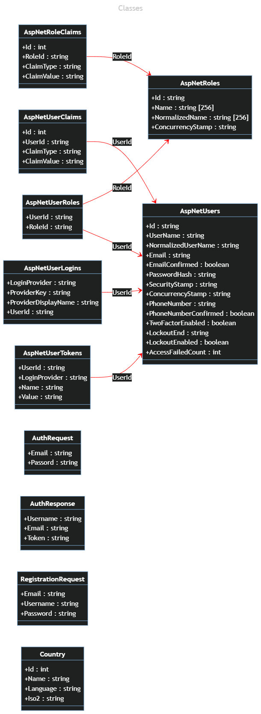

# SE StA API

Eine REST-Schnittstelle, die für die Verwendunbg in der Studienarbeit Softwareengineering II konzipiert ist. Dazu eine Datenbank und ein Angular Frontend.

## Die Datenbank

MySQL Datenbank in einem Docker Container. Daten-Volume im Unterordner db.

## Die Schnittstelle

Die REST-Schnittstelle umfasst eine Swagger-UI, diese beinhaltet eine Übersicht über alle verfügbaren Endpunkte. Das ganze läuft ebenfalls in einem Docker-Container.

## Das Frontend

Angular Anwendung in einem Docker Container.
Kann <b>bei lokal installierter Angular CLI</b> im Unterverzeichnis SE_StA_Angular mit
`ng serve --open`
gestartet werden. (min. Angular CLI 16.0.3)

## Start der Anwendung

In diesem Verzeichnis ein Terminal öffnen und folgenden Befehl absetzen:
`docker-compose up`

# Projektmanagement

Im Unterordner Projektmanagement liegen alle Dateien des ersten Artefakts der Studienarbeit:
Das überarbeitete Pflichenheft, der Projektstrukturplan sowie die Einsatzmittelpanung in der Excel-Datei "Projektstrukturplan", sowie der dazugehörige MPM-Netzplan mit Meilensteinen als SVG:

# Datenmodell

Die funktionalen Anforderungen gehen aus dem Pflichtenheft hervor. Hier ist das vollständige Datenmodell inklusive Umsetzung der Berechtigungsstruktur gezeigt.

## Klassendiagramm

# Für Entwickler

## Migration der Datenbank

Bei lokal installiertem .NET CORE 7 Migration erstellen mit: 
`dotnet-ef migrations add [Migration-Version]`
e.g.
`dotmet-ef migrations add migration-v0` 
Pushen zur Datenbank über 
`dotnet-ef database update` 
Dafür muss temporär in appsettings.json der server auf localhost gesetzt werden.
Nicht vergessen den Wert danach wieder auf mysql zu setzen.

## Zugangsdaten

Datenbank: root - BaqV7knGfeuYzC 
Mail: se.sta - D$xof7jR5h&S!bTrQK$W