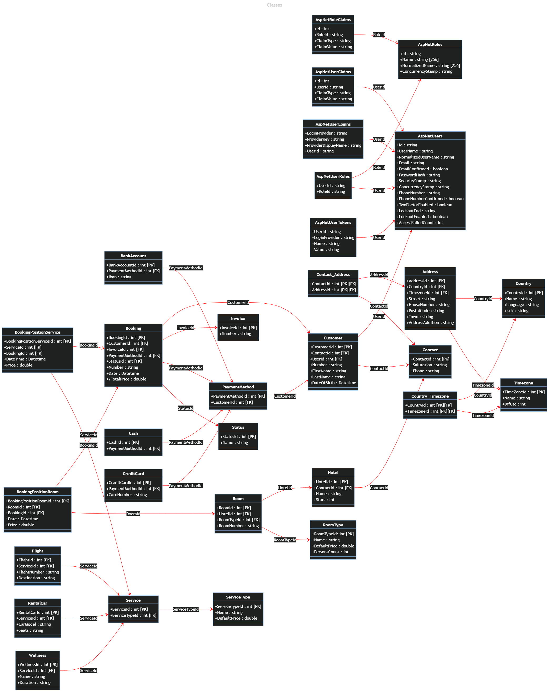

# SE StA API

Eine REST-Schnittstelle, die für die Verwendunbg in der Studienarbeit Softwareengineering II konzipiert ist. Dazu eine Datenbank und ein Angular Frontend.

## Die Datenbank

MySQL Datenbank in einem Docker Container.
Daten-Volume im Unterordner db.
**SQL-dump** im Unterordner init.

## Die Schnittstelle

Die REST-Schnittstelle umfasst eine Swagger-UI,
diese beinhaltet eine Übersicht über alle verfügbaren Endpunkte.
Das ganze läuft ebenfalls in einem Docker-Container.

## Das Frontend

Angular Anwendung in einem Docker Container.
Kann <b>bei lokal installierter Angular CLI</b> im Unterverzeichnis SE_StA_Angular mit
`ng serve --open`
gestartet werden. (min. Angular CLI 16.0.3)

## Start der Anwendung

In diesem Verzeichnis ein Terminal öffnen und folgenden Befehl absetzen:
`docker-compose up` 
Zusätzlich können die Docker-Images der API und des Angular-Frontends von
Docker-Hub bezogen werden, die Links zu den repositories befinden sich am Ende dieses Dokumentes. 
Nach dem Start sind folgende Webseiten im Browser erreichbar: 
**GUI: localhost:4200** 
**phpmyadmin: localhost:8080** 
**swagger UI: localhost:50001/swagger** 
In der GUI kann unter Account ein neuer Account registriert werden
(Menüpunkt register). Dazu muss die angegebene E-Mail validiert werden
(Menüpunkt validate oder Link in der E-Mail folgen). Danach kann ein
Login erfolgen.Es existiert auch bereits ein Administrator-Account: 
E-Mail: se.sta@chabbay.de 
Passwort: D$xof7jR5h&S!bTrQK$W

# Projektmanagement

Im **Unterordner Projektmanagement** liegen alle Dateien des ersten
Artefakts der Studienarbeit: 
Das überarbeitete Pflichenheft, der Projektstrukturplan
sowie die Einsatzmittelpanung in der Excel-Datei "Projektstrukturplan",
sowie der dazugehörige MPM-Netzplan mit Meilensteinen als SVG:

# Datenmodell

Die funktionalen Anforderungen gehen aus dem Pflichtenheft hervor.
Hier ist das vollständige Datenmodell inklusive Umsetzung der
Berechtigungsstruktur gezeigt.

## Klassendiagramm

# Für Entwickler

## Migration der Datenbank

Bei lokal installiertem .NET CORE 7 Migration erstellen mit: 
`dotnet-ef migrations add [Migration-Version]`
e.g.
`dotnet-ef migrations add migration-v0` 
Pushen zur Datenbank über 
`dotnet-ef database update` 
Dafür muss temporär in appsettings.json der server auf localhost gesetzt werden.
Nicht vergessen den Wert danach wieder auf mysql zu setzen.

## Zugangsdaten

Datenbank: root - BaqV7knGfeuYzC 
Mail: se.sta - D$xof7jR5h&S!bTrQK$W

## Aktuell fehlende Endpunkte

- Alle Kontakte inklusive Adressen mit Ländern und Zeitzonen
- Alle Buchungen zu einem Kunden (customers/:id/bookings)
- Alle Zimmer zu einem Hotel inklusive Zimmer-Typ
- Alle 3 Dienstleistungen jeweils inklusive Dienstleistung und Dienstleistungs-Typ

# Die Docker-Images

## Docker Image ASP.NET CORE API

https://hub.docker.com/r/chabbay/sestaapi

## Docker Image Angular Frontend

https://hub.docker.com/r/chabbay/sestaangular